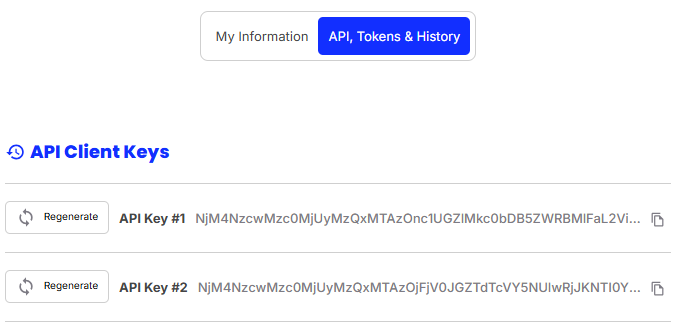

# Img 2 Design - WebAPI Background Removal - Sample Code

This repository contains sample code for integrating with a WebAPI that removes the background from images. The code samples cover how to authenticate, handle API requests, manage rate limits, and handle different account tiers.

## API Authentication

To use the API, you need a **user token**, which can be retrieved from your account’s **settings** page. 



The token is valid for **1 year** and can be revoked / regenerated at any time. Each user is provided with **two tokens**. Please note that tokens should not be shared and must be used **server-side**.

### Account Tiers

- **Free Account**:
  - Rate Limit: **10 images per minute**
  - Monthly Limit: **50 images** per month with watermark
- **Creator Plan**:
  - Rate Limit: **20 images per minute**
  - Monthly Limit: **1000 images** per month with watermark
- **Studio & Api Account**:
  - Rate Limit: **50 images per minute**
  - Monthly Limit: Based on the user’s subscription plan (no watermark)

## Rate Limiting

When using the API, be aware of the rate limiter.

* For the **Free** and **Creator** plans, you must track your usage to ensure you don’t exceed the limit.
* For a **Studio** or **Api** plan, the rate limit will depend on your subscription. Always check the rate limit headers in the API response to avoid exceeding the limit.

## Folder Structure

```bash
/img2design-api-remove-background-sample-code 
│ ├── readme.md 
│ ├── /src 
│ │ ├── /CSharp 
│ │ ├── /Node 
│ │ ├── /PHP 
│ │ ├── /Python 
```

## download the sample project

1. Clone the repository:

```bash
git clone https://github.com/nwltech/img2design-api-remove-background-sample-code.git
```

2. Navigate to the project directory:

```bash
cd img2design-api-remove-background-sample-code/src
```

## Contributing

If you'd like to contribute to this project, feel free to submit a pull request with your changes. Be sure to follow the coding standards in place and provide clear documentation for your code.

## License

This repository is licensed under the MIT License - see the LICENSE file for details.
